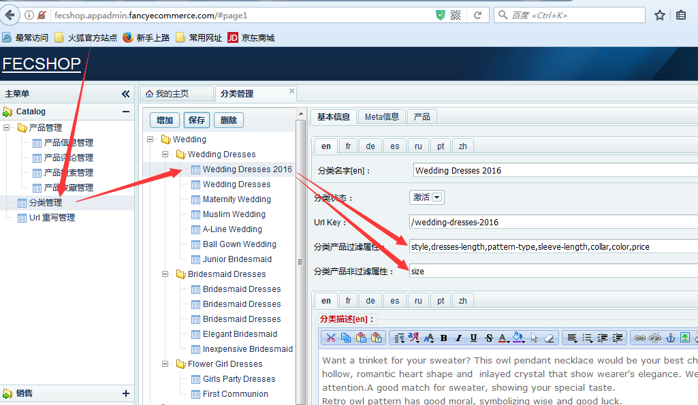
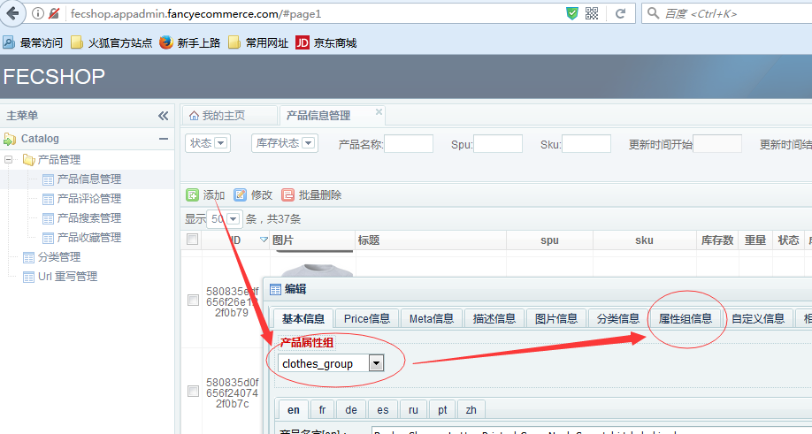
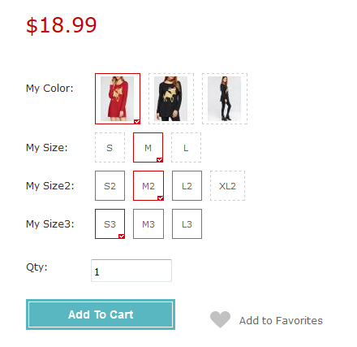

Fecshop 产品
============

> 作为电商系统，很多地方都是围绕产品展开的，譬如产品分类，产品搜索，产品评论，
> 产品收藏，购物车产品，订单产品等等。

### 后台产品编辑


### 产品属性组：

产品除了价格，名字，库存等一些公用的属性外，
产品根据不同的分类，会有一些独有的属性，
譬如电脑类产品会有cpu型号，主板型号等属性，
衣服类有颜色尺码等属性，在这里引入产品属性组的概念，
一类产品从属于一个属性组。

属性组的配置：

打开文件：`@common/config/fecshop_local_services/Product.php`文件
可以看到对属性组的配置

配置文件的内容太多，这么不贴出来的，您可以打开这个文件查看具体内容，里面有注释


属性组里面的属性有类别，目前有三个类：

1、**spu_attr**

1.1 spu和sku的概念：sku是产品的唯一标示，最小库存单位，譬如一款鞋子为一个spu，这款鞋子的不同的颜色和不同的尺码为一个sku，

1.2 什么是spu属性（`spu_attr`），当一款鞋子的不同的sku是颜色和尺码的不同，那么颜色和尺码就是这款鞋子的spu属性（spu_attr）。

1.3 `spu_attr`是用来在产品详细页面，将这个spu下面的所有sku串联起来，譬如页面：http://fecshop.appfront.fancyecommerce.com/index.php/raglan-sleeves-letter-printed-crew-neck-sweatshirt-53386451-77774122
访问这款衣服的每一个SKU，都会把其他的sku列出来，点击后，就进去其他sku的页面，您会发现url是变化的，这个是类似于京东的方式。
注意：	

1.3.1 因为组合的复杂性，`spu attr`最多设置2个属性，不能超过2个(如果超过会出问题。spu属性会都不显示)，超过两个请使用customer_option的方式。也就是类似于淘宝的方式。

1.3.2 这里的属性需要严格按照下面的格式进行配置，如果您想配置自己的spu属性，那么

1.3.3 通过链接：https://fecshop.appfront.fancyecommerce.com/raglan-sleeves-letter-printed-crew-neck-sweatshirt-41214715
您可以看到，color属性是用图片来显示的，
在spu_attr中，第一个属性默认用图片显示，譬如：


```
'spu_attr' => [  # spu用来区分sku的属性，譬如下面的属性的不同，对应不同的sku，进而是不同的库存
	# 第一个属性会被用户当做图片来显示。
	'color'	  => [
		'dbtype'=> 'String',
		'label'	=>'颜色',
		'name'	=>'color',
		'sort_order' => 1,
		'display'=>[
			'type' => 'select',
			'data' => [
				'one-color' 	=> 'one-color',
				'red' 			=> 'red',
				'white' 		=> 'white',
				'black' 		=> 'black',
				'blue' 			=> 'blue',
				'green' 		=> 'green',
				'yellow' 		=> 'yellow',
				'gray'			=> 'gray',
				'khaki'			=> 'khaki',
				
				'ivory'			=> 'ivory',
				'beige'			=> 'beige',
				'orange'			=> 'orange',
				'cyan'			=> 'cyan',
				'leopard'		=> 'leopard',
				'camouflage'	=> 'camouflage',
				
				'silver'		=> 'silver',
				'pink'			=> 'pink',
				'purple'		=> 'purple',
				'brown'			=> 'brown',
				'golden'		=> 'golden',
				'multicolor'	=> 'multicolor',
				'white & blue' 	=> 'White & Blue',
				'white & black' 	=> 'White & Black',
			]
		],
		//'require' => 0,
		//'default' => 2,
	],
	# 第二个属性不会当做图片来显示
	'size'	  => [
		'dbtype'=> 'String',
		'label'	=>'尺码',
		'name'	=>'size',
		'sort_order' => 2,
		'display'	=>[
			'type' 	=>'select',
			'data' 	=>[
				'one-size' 	=> 'one-size',
				'S' 	=> 'S',
				'M' 	=> 'M',
				'L' 	=> 'L',
				'XL' 	=> 'XL',
				'XXL' 	=> 'XXL',
				'XXXL' 	=> 'XXXL',
			]
		],
		//'require' => 0,
		//'default' => 2,
	],
	
],
```

color 将会被当做图片来显示出来。


2、**general_attr（普通属性）**，可以是各种格式的值，譬如时间格式，email格式，下拉条选择值等。这些属性可以用于分类侧栏属性过滤。

示例配置：

```
'general_attr' => [  
	# 这是input type='text' 的类型
	'my_remark' => [
		'dbtype'=> 'String',
		'label'=>'我的备注',
		'name'=>'my_remark',
		'display'=>[
			'type' => 'inputString',   # 字符串格式的属性
		],
		'require' => 0,
	],
	# 这是input type='email' 的类型
	'my_email' =>[
		'dbtype'=> 'String',
		'label'=>'我的邮箱',
		'name'=>'my_email',
		'require' => 0,
		'display'=>[
			'type' => 'inputEmail',		# 字符串格式的属性（email格式验证）
		],
	],
	# 这是input type='date' 的类型
	'my_date'  => [
		'label'=>'我的日期',
		'name'=>'my_date',
		'display'=>[
			'type' => 'inputDate',		# 字符串格式的属性（Date格式验证）
		],
	],
	# 这是<select> 的类型
	'style'   => [
		'dbtype'=> 'String',
		'label'	=>'类型',
		'name'	=>'style',
		'display'	=>[
			'type' 	=>'select',		# 下拉条选择格式的属性
			'data' 	=>[
				'Casual' 	=> 'Casual',
				'Cute' 		=> 'Cute',
				'Sexy & Club'=> 'Sexy & Club',
				'Bohemian' 	=> 'Bohemian',
				'Vintage ' 	=> 'Vintage ',
				'Brief' 	=> 'Brief',
				'Work' 		=> 'Work',
				'Novelty' 	=> 'Novelty',
			]
		],
	],
	
	'dresses-length' 	=> [
		'dbtype'=> 'String',
		'label'	=>'裙长',
		'name'	=>'dresses-length',
		'display'	=>[
			'type' 	=>'select',	# 下拉条选择格式的属性
			'data' 	=>[
				'Mini' 	=> 'Mini',
				'Knee-Length' 		=> 'Knee-Length',
				'Mid-Calf'=> 'Mid-Calf',
				'Ankle-Length' 	=> 'Ankle-Length',
				'Floor-Length ' 	=> 'Floor-Length ',
				
			]
		],
	],
	
	
	'pattern-type' 	=> [
		'dbtype'=> 'String',
		'label'	=>'款式',
		'name'	=>'pattern-type',	# 属性名字
		'display'	=>[
			'type' 	=>'select',	# 下拉条选择格式的属性
			'data' 	=>[
				'Animal' 	=> 'Animal',
				'Character' 		=> 'Character',
				'Floral'=> 'Floral',
				'Geometric ' 	=> 'Geometric ',
				'Leopard '=> 'Leopard ',
				'Letter'=> 'Letter',
				'Paisley'=> 'Paisley',
				'Patchwork'=> 'Patchwork',
				'Polka Dot'=> 'Polka Dot',
				'Print'=> 'Print',
				'Striped'=> 'Striped',
				
			]
		],
	],
	
	'sleeve-length' 	=> [
		'dbtype'=> 'String',
		'label'	=>'袖长',
		'name'	=>'sleeve-length',
		'display'	=>[
			'type' 	=>'select',
			'data' 	=>[
				'Sleeveless' 	=> 'Sleeveless',
				'Short-Sleeves' 		=> 'Short Sleeves',
				'Half-Sleeves'=> 'Half Sleeves',
				'3-4-Length-Sleeves ' 	=> '3/4 Length Sleeves ',
				'Long-Sleeves '=> 'Long Sleeves ',
				
			]
		],
	],
	
	'collar' => [
		'dbtype'=> 'String',
		'label'	=>'领口',		# 后台显示的中文名（目前后台只有中文）
		'name'	=>'collar',
		'display'	=>[
			'type' 	=>'select',
			'data' 	=>[
				'Round Neck' 	=> 'Round Neck',	# 下拉条里面对应的各个可以选择的值。
				'V-Neck' 	=> 'V-Neck',
				'Hooded' 	=> 'Hooded',
				'Turn-down-Collar' 	=> 'Turn-down Collar',
				
			]
		],
		//'require' => 0,
		//'default' => 2,
	],
],
```


3、**custom_options用户自定义属性**，显示方式方面有点和spu属性类似，spu属性显示的方式是京东的方式，点击每一个选项是url跳转的
用户自定义类似于淘宝的方式，选择各个颜色尺码，页面是不跳转的，各个颜色尺码有相应的图片，库存，价格，sku等。
您可以查看演示地址：`http://fecshop.appfront.fancyecommerce.com/index.php/reindeer-pattern-glitter-christmas-dress-86519596`
您可以给产品属性组添加的属性类型就上面几种，在后台编辑产品的时候，选择不同的属性组，就会加载相应的属性出来。

示例配置：

```
'custom_options' => [
					
	'my_color'	  => [
		'dbtype'=> 'String',  #类型
		'label'	=>'My Color', # 显示的名字
		'name'	=>'color',	  # 在数据库中存在的列名
		'showAsImg' => true,  # （在前端展示部分）通过图片的方式展示属性。譬如；http://fecshop.appfront.fancyecommerce.com/index.php/reindeer-pattern-glitter-christmas-dress-86519596，
							  #		你会发现，该属性对应的显示方式不是值，而是产品的图片。
		'require' => 1,  # 1代表是必填选项，0代表选填
		'display'=>[
			'type' => 'select',
			'data' => [
				'red' 			=> 'red',
				'white' 		=> 'white',
				'black' 		=> 'black',
				'blue' 			=> 'blue',
				'green' 		=> 'green',
				'yellow' 		=> 'yellow',
				'gray'			=> 'gray',
				'khaki'			=> 'khaki',
				
				'ivory'			=> 'ivory',
				'beige'			=> 'beige',
				'orange'			=> 'orange',
				'cyan'			=> 'cyan',
				'leopard'		=> 'leopard',
				'camouflage'	=> 'camouflage',
				
				'silver'		=> 'silver',
				'pink'			=> 'pink',
				'purple'		=> 'purple',
				'brown'			=> 'brown',
				'golden'		=> 'golden',
				'leopard'		=> 'leopard',
				'multicolor'	=> 'multicolor',
				'white & blue' 	=> 'White & Blue',
				'white & black' 	=> 'White & Black',
			]
		],
		
	],
	
	'my_size'	  => [
		'dbtype'=> 'String',
		'label'	=>'My Size',
		'name'	=>'size',
		'require' => 1,
		'display'	=>[
			'type' 	=>'select',
			'data' 	=>[
				'S' 	=> 'S',
				'M' 	=> 'M',
				'L' 	=> 'L',
				'XL' 	=> 'XL',
				'XXL' 	=> 'XXL',
				'XXXL' 	=> 'XXXL',
			]
		],
		
	],
	

],
```			 

通过链接：https://fecshop.appfront.fancyecommerce.com/reindeer-pattern-glitter-christmas-dress
。您可以看到颜色是用图片实现的，如果您想用图片显示，那么
您需要设置`'showAsImg' => true`	即可。
只能有一个custom_option属性设置为true，如果多个设置为true，只有一个
有效，其他的会被忽略。		 
	

上面是属性组里面的三种属性类型，分别是：
`spu_attr`  `general_attr` 和  `custom_options`	
，我们可以通过配置的方式添加多个属性组，每一个属性组包含上面
的三种属性，譬如衣服裙子一个属性组，电脑一个属性组，手机一个属性组
等等，
通过属性组配置的方式可以很方便的扩展产品独有的属性，
在配置文件中配置好产品属性组后，
在后台
编辑产品的时候选择相应的属性组即可添加相应的属性，对于属性组里面的属性，一旦编辑后
。尽量不要经常的改动。


### 分类页面产品属性过滤的设置

就是前端页面侧栏的产品过滤，如图：


如何设置呢？

1、全局设置：首先打开配置文件
`@appfront/config/fecshop_local_modules/Catalog.php`

配置

```
return [
	'catalog' => [
		'params'=> [
			###############################
			## 		category部分设置	 ##
			###############################
			'category_breadcrumbs' => false, # 是否显示分类的面包屑导航。
			/**
			 * 注意：做侧栏分类产品过滤的属性，必须是select类型的，其他的类型请不要用，
			 * 对于select类型，目前不支持多语言数据库存储，select类型的各个值是通过前端翻译文件来实现翻译的、
			 * 对于color  size 对应的保存值，只可以使用 '数字','字符','空格','&','-','_' 这6类字符
			 */
			'category_filter_attr' =>[
				'color','size',
			], 
			
			'category_filter_category' 	=> true,
			'category_filter_price' 	=> true,
```

category_filter_attr 就是配置分类侧栏的产品属性过滤，目前设置了color和size
，这里设置后是一个公用的设置，也就是所有的分类就默认为这两个属性的过滤。

`category_filter_category`代表侧栏是否显示分类的过滤

`category_filter_price`代表侧栏是否显示价格的过滤。

2、个性化设置

在上面设置的全局设置的基础上，可以进行个性化设置，后台打开分类，如图：



**分类产品过滤属性：**是在全局设置的基础上添加一些新的产品属性，用于分类侧栏属性过滤

**分类产品非过滤属性：**是在全局设置的基础上删除一些产品属性，譬如下面的图中，
添加的是size，虽然在全局设置中添加了size，但是该分类添加了size，因此该
分类侧栏的属性过滤不会有size。

通过上面，我们可以很方便的添加产品在分类侧栏的属性过滤。


### 搜索页面产品属性过滤的设置

1.首先设置搜索语言，`@common/config/fecshop_local_services/Search.php`

1.1

```
return [
	'search' => [
		'filterAttr' => [
			'color','size', # 在搜索页面侧栏的搜索过滤属性字段
		],
		'childService' => [
			'mongoSearch' => [
				'searchIndexConfig'  => [ #设置用于全文搜索的产品属性以及权重，权重高的属性，排名靠前。
					'name' => 10,  	# 产品name作为full search text的属性，权重为10
					'description' => 5,   # 产品description作为full search text的属性，权重为5
				],  
				# more: https://docs.mongodb.com/manual/reference/text-search-languages/#text-search-languages
				'searchLang'  => [
					'en' => 'english',
					'fr' => 'french',
					'de' => 'german',
					'es' => 'spanish',
					'ru' => 'russian',
					'pt' => 'portuguese',
				],
			],
			'xunSearch'  => [
				'fuzzy' => true,  # 是否开启模糊查询
				'synonyms' => true, #是否开启同义词翻译
				'searchLang'    => ['zh'],
			],
		],
	]
];
```
1.1
`filterAttr`是添加在搜索页面侧栏用于过滤的产品属性。

1.2
`searchIndexConfig`是设置用于全文搜索的产品属性以及权重，权重高的属性，排名靠前。

1.3
`searchLang`是设置搜索的语言，全文搜索是需要根据语言切词的，
因此各个语言的搜索会略有差异，根据各个语言，生成对应的产品语言搜索表。

2.生成搜索表

首先需要根据上面的配置文件，设置您的所有的语言。也就是上面的`searchLang`。

每一个语言对应一个产品搜索表，这是因为mongodb的full text search，一个表只能有一个
语言选项，因此需要生成多个产品搜索表，生成的脚本为：

`@fecshop/shell/search/fullSearchSync.sh`，您进入@fecshop/shell/search下
执行`sh fullSearchSync.sh`即可。

### 设置产品的自定义属性

产品的自定义属性如图：


#### 1.产品的自定义有方式，京东模式和淘宝模式

1.1京东模式：类似于京东的产品，选择每一个选项后，页面会跳转到另外一个url页面，
也就是说：每一个选项就是一个产品（在数据库产品表中是一行数据）。

1.2淘宝模式：类似于淘宝商城的产品，选择一个选项后，产品页面不会跳转。

#### 2.下面详细说明：

2.1京东模式：这种模式，需要引入sku和spu的概念，关于这个概念在上面已经说明。
譬如页面（演示demo）：http://fecshop.appfront.fancyecommerce.com/index.php/raglan-sleeves-letter-printed-crew-neck-sweatshirt-53386451-77774122

2.1.1配置：首先需要设置一个属性组，上面的内容已经说明，在配置文件中添加，
需要注意的spu属性不能超过两个（spu属性组合的复杂性）。

2.1.2新建产品，选择对应的属性组,如图



就可以查看到这个属性组中的属性，填写值即可。

填写sku和spu，需要注意的是，您新建的该款产品的spu必须相同，sku不同，一般用您的
spu+spu属性的值组合成sku，如图，我新建的spu对应的几个sku产品。


2.1.3 按照上面如图的方式配置完成后，基本就完成了配置，在前台就可以看到了。

2.2淘宝模式，演示demo：http://fecshop.appfront.fancyecommerce.com/index.php/reindeer-pattern-glitter-christmas-dress-86519596

2.2.1配置：需要在属性组里面配置 `custom_options用户自定义属性`，这个在上面已经
说明如何配置，您可以参考上面的说明中的文件中的例子进行修改。

2.2.2后台编辑

在属性组中添加了 `custom_options用户自定义属性`，在新建产品的时候点击添加，弹出产品编辑的弹框，
选择相应的属性组，然后点击 “自定义信息”，如图：


勾选，填写各个属性的值，以及选择图片，最后点击+号图标，就可以添加一行，
添加完了，保存，就可以到产品详细页面看了，譬如产品
`http://fecshop.appfront.fancyecommerce.com/index.php/reindeer-pattern-glitter-christmas-dress-86519596`



如果某些组合，您没有添加，就会看到某些选项是虚线标示，如果没有库存，也会虚线标示。
对于该产品，产品sku的库存会无效，产品自定义部分的库存才是相应选项的库存
，当该产品被下单后，也是在该选项对应的qty部分减少产品的库存，而不是sku的库存（qty）

### 产品价格


成本价格：代表产品的成本，也就是采购在fecshop中，只是记录一下，没有其他用处，
当然，您可以通过脚本，生成您的出售价格。

销售价格：也就是产品在页面显示的价格

销售特价：产品的特价，当设置了产品的特价，而且特价时间没有过期，则特价是有效的，
当销售特价有效时，销售价格就会失效。

特价开始时间：产品销售特价开始的时间

特检结束时间：产品销售特价结束的时间

Tier Price： 批发价格

规定产品购买几个以上的价格。譬如购物2个以上17美元，购买4个以上16美元。

对于在产品分类页面显示的产品的几个都是一个产品的价格。产品中有一个最终价格，
是通过脚本计算出来的，这个最终价格用于在分类页面的价格排序以及价格过滤，该脚本一天跑一次。
文件为： @fecshop/shell/computeProductFinalPrice.sh，
可以在cron中配置该脚本一天跑一次。

### 产品导入和导出

目前后台还没有做这个功能。


